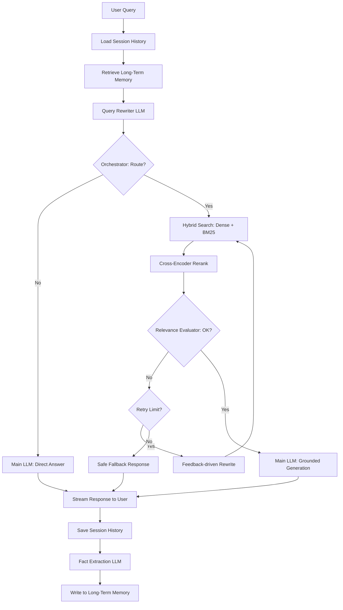

# Advanced RAG Chatbot

A production-grade, agentic RAG chatbot backend featuring hybrid search, cross-encoder reranking, evaluation via RAGAS, observability via structlog and tracing, persistent memory, and MCP integrations.

## Architecture

Below is a conceptual flowchart of the RAG pipeline:



For detailed architectural justifications and design decisions, please see the [RAG Chatbot Project Plan](file:///c:/Users/HP/Downloads/Knowify/RAG_Chatbot_Project_Plan.md).

## Project Scaffolding

This project is organized into three main modules:
- `/backend`: FastAPI service managing the orchestration, retrieval, memory, evaluation, and logging.
- `/frontend`: Placeholder for client web application.
- `/eval`: RAGAS golden test set and evaluation pipeline scripts.

## Quick Start (Docker Compose)

Prerequisites:
- Docker and Docker Compose

To spin up all services (FastAPI Backend, Qdrant Vector DB, Redis Cache):

```bash
# Clone the repository and navigate to root
cd Knowify

# Copy the example environment variables
cp .env.example .env

# Spin up services
docker-compose up --build
```

The services will be available at:
- **FastAPI API**: http://localhost:8000
- **FastAPI OpenAPI Docs**: http://localhost:8000/docs
- **Qdrant Dashboard**: http://localhost:6333/dashboard
- **Redis Cache**: http://localhost:6379 (accessible inside the network)
