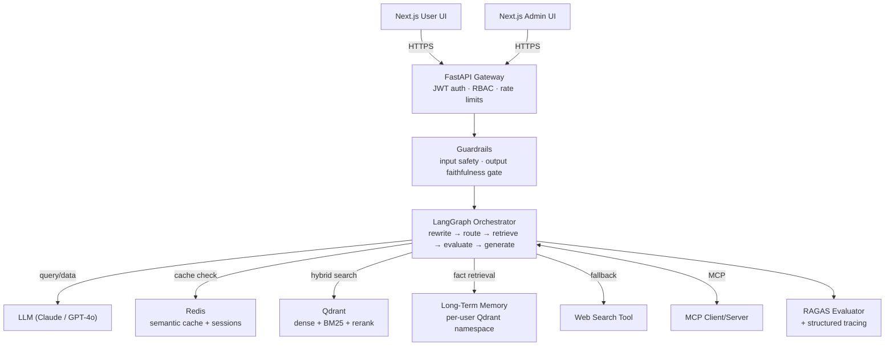

<div align="center">

# 🟢 Knowify

### A production-grade RAG platform that becomes *your* product's support assistant. This repo demonstrates it configured for a fictional SaaS CRM, AcmeCRM.

Point Knowify at any product's docs — PDFs, API references, spreadsheets, FAQs — and it answers questions instantly, with the exact source and page cited for every claim. This repo includes a fully working local setup, seeded with the AcmeCRM demo dataset, so you can run it yourself and see exactly how it behaves. Swap the documents and it becomes your assistant, or your client's.

[](https://www.python.org/)
[](https://fastapi.tiangolo.com/)
[](https://www.langchain.com/langgraph)
[](https://qdrant.tech/)
[](https://redis.io/)
[](https://nextjs.org/)
[](https://github.com/explodinggradients/ragas)
[](https://modelcontextprotocol.io/)
[](./LICENSE)
[](https://github.com/m-hannanfaisal/Knowify/actions/workflows/ci.yml)

<!-- **[⚡ Run it locally ↓](#getting-started)** &nbsp;·&nbsp; **[See it in action ↓](#see-it-in-action)** &nbsp;·&nbsp; **[Try the demo dataset ↓](#try-it-yourself-the-acmecrm-demo)** -->

</div>

---

## What Knowify Does

- **Answers questions from your actual documents** — PDFs, Word docs, Excel sheets, CSVs, JSON, HTML, and even screenshots (via OCR) — not from a generic model's guesswork.
- **Cites every answer**, inline, back to the exact source file and page — so support reps, customers, or your own team can verify it in one click instead of taking the bot's word for it.
- **Catches its own bad retrievals.** If the first search comes up thin, it automatically rewrites the question and tries again before ever answering — instead of confidently making something up.
- **Remembers your users** across sessions, not just within one conversation.
- **Enforces real access control.** JWT-based auth with scoped roles — client and admin routes are properly gated, not just conceptually separated.
- **Guards its own output.** Input checks catch injection/leak attempts before they reach the pipeline; output is refused rather than shown if its own faithfulness score drops too low.
- **Ships with a live admin dashboard** — trace every conversation step-by-step, track token usage and cost per user, manage the document library, and inspect what the system has "remembered."
- **Plugs into your existing AI tools** via MCP — Knowify's retrieval pipeline can be exposed as a tool inside Claude Desktop, Claude Code, or any MCP-compatible agent.
<!-- 
## See It In Action

<div align="center">

</div>

**Example, from the included demo:**

> **User:** "Why is webhook verification failing?"
> **Knowify:** "The most common causes are using the wrong signing secret, hashing a re-serialized body instead of the raw request bytes `[1]`, or clock skew against the payload's timestamp `[2]`. Use the Send Test Event button to isolate the issue without waiting for a live event `[1]`."
> *[1] troubleshooting-webhooks.md · [2] api-reference.md* -->

---

## Architecture



> Rendered directly by GitHub's native Mermaid support — no external image needed.

## Tech Stack

**Backend:**


**Security:**


**Retrieval:**


**Ingestion:**


**Orchestration & Generation:**


**Evaluation & Observability:**


**Tooling/Protocol:**


**Frontends:**

-000000?logo=next.js&logoColor=white)


*Hand-tuned dark/green design system, not default framework styling.*

**Infra:**


---

## Try It Yourself: the AcmeCRM Demo

Included in this repo is **a fully working local deployment of the Knowify platform**, seeded with a sample knowledge base for a fictional SaaS CRM company called AcmeCRM. Its knowledge base — product docs, API/webhook reference, billing policy, security policy, user manual, feature-comparison sheet, FAQs, integrations list, and a support-console error screenshot — exists to prove the platform out across every document format it supports, with cross-document questions that have one verifiable correct answer. Clone the repo and follow [Getting Started](#getting-started) to run it yourself.

Ask it things like:
- *"How do I create an API key?"*
- *"What's included in the Professional plan?"*
- *"Why is webhook verification failing?"*
- *"Can I export my contacts?"*

**This is the same platform, not a one-off demo bot.** Point it at a different set of documents — your product docs, your client's support library, your internal wiki — and it runs the same way, with the same retrieval quality, citations, guardrails, and admin tooling. That's the deliverable: not "a chatbot," but a platform that becomes *your* chatbot once it's pointed at your content.

> **Available for freelance/contract work** — if you want a version of this built and deployed against your own documentation, see [Contact](#contact) below.

## Engineering Highlights

| Decision | Alternative considered | Why this choice won |
|---|---|---|
| Hybrid retrieval (dense + BM25 + RRF + rerank) | Pure vector search | Exact-term queries (API names, error codes) fail on embeddings alone |
| Corrective retry loop | Trust top-K blindly | Silent retrieval failure is the #1 hallucination source |
| Semantic cache | No caching / exact-match cache | Paraphrased repeat questions are common in support use cases |
| Long-term memory (separate namespace) | Session-only history | Personalization across sessions, not just within one chat |
| Single orchestrator (LangGraph StateGraph) | Handoff-based multi-agent | Easier to trace, evaluate, and debug at this scale |
| MCP client + server | Hardcoded tool integrations | Composable, standard, and works both as consumer and provider |
| JWT + role-scoped access | Single shared API key | Admin operations (delete, reindex, cost data) need real enforcement, not convention |
| Output faithfulness gate | Trust every generation | An unfaithful answer with a citation is more dangerous than a refusal |

<details>
<summary><strong>Read the full technical rationale behind each decision</strong></summary>

<br>

**Why hybrid retrieval, not naive vector search.** Pure dense (embedding) retrieval fails predictably on exactly the kind of content a real knowledge base contains: exact API endpoint names, error codes, plan names, and version numbers — short, specific tokens that don't carry much semantic "meaning" for an embedding model to latch onto, but that a keyword search finds instantly. A question like *"what does a 429 response mean"* is a lexical lookup wearing a natural-language costume. So retrieval runs two passes in parallel — dense (Qdrant) for conceptual queries, sparse (BM25) for exact-term matches — fused with Reciprocal Rank Fusion, since RRF is rank-based and doesn't require the two systems' similarity scores to be on comparable scales. A cross-encoder rerank pass then re-scores the fused top-N, since RRF fusion order is a cheap heuristic, not a relevance judgment — the reranker is the expensive, accurate pass, applied only to the shortlist so cost stays bounded.

**Why a self-correcting retry loop (Corrective RAG).** Retrieval is the single most common failure point in RAG systems, and it fails silently — an LLM will happily generate a fluent, confident answer from irrelevant chunks if nothing stops it. An LLM-as-judge evaluator checks whether retrieved chunks are actually sufficient for the query before generation runs. If not, it rewrites the query using the evaluator's own feedback and retries (capped, with a safe fallback) — this is the single biggest lever against hallucination in this system, ahead of any prompting trick.

**Why semantic caching.** Every retry, rerank, and evaluator call is a real LLM call with real latency and cost — and support questions repeat constantly, often in paraphrased form. A Redis-backed semantic cache checks incoming queries against previously-answered ones by embedding similarity, not exact string match. In a support-bot deployment where a small number of questions account for most volume, this materially changes the unit economics of running the system, not just the speed.

**Why long-term memory, not just session history.** Session-scoped history solves "remember what we discussed a minute ago," not "remember this user across sessions." Knowify extracts durable facts from each conversation via an LLM call, stores them in a per-user Qdrant namespace, retrieves relevant ones on future queries, and periodically consolidates near-duplicates — a second, smaller RAG pipeline running alongside the document one.

**Why single-orchestrator, not multi-agent.** It was tempting to build this as a handoff-based multi-agent system. Deliberately didn't. Multi-agent systems are harder to evaluate and trace, and a lot of "multi-agent" RAG demos are multi-agent in name only — chained prompts with extra ceremony. Knowify's orchestrator is a single LangGraph `StateGraph` with sequential, specialized nodes — genuinely agentic in its conditional control flow (the retry loop is a real conditional edge), but kept debuggable enough that every RAGAS score and trace can be attributed to a specific node.

**Why MCP (client and server).** Model Context Protocol is becoming the standard connective layer for agentic tools rather than every project hand-rolling its own tool-calling convention. Knowify implements both directions: an MCP client (calling external servers as tools) and an MCP server (exposing its own retrieval pipeline as a `query_knowledge_base` tool pluggable into Claude Desktop or Claude Code) — demonstrating the pipeline as a composable tool, not just a standalone chatbot.

**Why JWT + role-scoped access, not a single shared key.** Admin routes delete documents, delete memory records, and expose per-user cost data — operations that need real enforcement, not just a convention that "only admins call these." Client-facing routes validate a standard JWT payload; admin routes additionally check for an `admin` claim and return HTTP 403 otherwise. This is the minimum bar for a system that could plausibly sit in front of real users rather than just a local demo.

**Why an output faithfulness gate, not just input filtering.** Input-side checks (prompt-injection detection, vector/SQL injection patterns) stop malicious queries, but they don't stop the model from confidently generating an unsupported claim from thin retrieval — that failure mode is generative, not adversarial. Knowify scores each generated answer's faithfulness against its retrieved context before returning it; if the score drops below threshold, the system refuses rather than returns an ungrounded answer with a citation attached, since a wrong answer that *looks* verified is worse than a visible refusal.

</details>

---

## Evaluation Results

Every claim above is checked against a 12-question golden set (`eval/golden_set.json`) spanning easy lookups, cross-document reasoning, tabular/numeric questions, an image-sourced question, and one deliberate out-of-scope query — scored with RAGAS:

| Metric | Score | Threshold |
|---|---|---|
| Faithfulness | 0.90 | 0.80 |
| Context Precision | 0.87 | 0.80 |
| Answer Relevancy | 0.91 | — |
| Context Recall | 0.88 | — |
| Answer Correctness | 0.89 | — |

**What RAGAS caught:** context precision came in meaningfully lower than faithfulness on first evaluation — the pipeline was often retrieving relevant-*adjacent* chunks (e.g. general billing policy text for a question that needed the specific feature-comparison table) rather than the single most precise source, which the reranker step was added specifically to address. Cross-document and tabular/numeric questions remain the categories worth watching most, since they're structurally harder than single-document lookups.

This evaluation is wired into CI (`.github/workflows/ci.yml`) with a tolerance-banded threshold, not exact-match, since LLM output is non-deterministic by nature.

---

## Getting Started

```bash
git clone https://github.com/m-hannanfaisal/Knowify.git
cd Knowify
cp backend/.env.example backend/.env   # add your LLM_API_KEY, EMBEDDING_API_KEY, JWT_SECRET, etc.

# Local development (no Docker required — Qdrant runs embedded, cache is in-memory)
cd backend && pip install -r requirements.txt --break-system-packages
uvicorn app.main:app --reload

# Seed the AcmeCRM demo dataset
python backend/scripts/seed_acmecrm.py

# Run evaluation
python eval/run_ragas.py

# Frontends
npm install --prefix frontend-user && npm run dev --prefix frontend-user
npm install --prefix frontend-admin && npm run dev --prefix frontend-admin
```

Production deployment is configured via Docker + `render.yaml` (see `docker-compose.yml` for the full networked Qdrant/Redis setup) but not yet live — a hosted demo link will be added here once deployed.

## Repository Structure

```
knowify/
├── backend/
│   ├── app/
│   │   ├── api/            # FastAPI routers (user + admin)
│   │   ├── orchestrator/   # LangGraph StateGraph, tools, MCP client/server
│   │   ├── retrieval/      # hybrid search + reranking
│   │   ├── evaluation/     # relevance evaluator
│   │   ├── memory/         # short-term + long-term memory
│   │   ├── ingestion/      # multi-format + image parsing
│   │   ├── core/           # auth (JWT/RBAC), guardrails, config
│   │   └── logging/        # structured logging
│   ├── sample_data/acmecrm/  # demo knowledge base
│   └── tests/
├── eval/                    # golden_set.json + run_ragas.py
├── frontend-user/           # Next.js chat UI
├── frontend-admin/          # Next.js operator dashboard
├── .github/workflows/       # CI (tests + RAGAS threshold gate)
├── render.yaml
└── docker-compose.yml
```

---

## Status & What's Still Open

Core pipeline — multi-format ingestion, hybrid retrieval, the corrective retry loop, long-term memory, semantic caching, MCP client/server, grounded generation with citations, RAGAS-gated CI, JWT-based authentication with role-scoped admin access, and input/output guardrails (prompt-injection detection and faithfulness-based refusal) — is built and evaluated end-to-end.

**Still open:** production deployment (networked Qdrant/Redis via Docker — Render config is written but not yet deployed live), and expanding the evaluation set and demo knowledge base beyond their current small scale.

**Known limitations:** context precision on cross-document and tabular/numeric questions is the current weak point — an area for continued tuning, not a solved problem. The demo dataset is intentionally small (~13 documents) rather than the 80–150 scale a real production knowledge base might have.

---

## Contact

<div align="center">

**Hannan Faisal — AI Automation Specialist**

[](mailto:hannanfaisal0507@gmail.com)

**Available for freelance projects**

Specializing in: n8n workflow automation · LLM integrations · WhatsApp bots · Lead generation systems · AI-powered document processing · RAG chatbots

</div>

---

## License


MIT License — free to use, adapt, and deploy for client projects.
